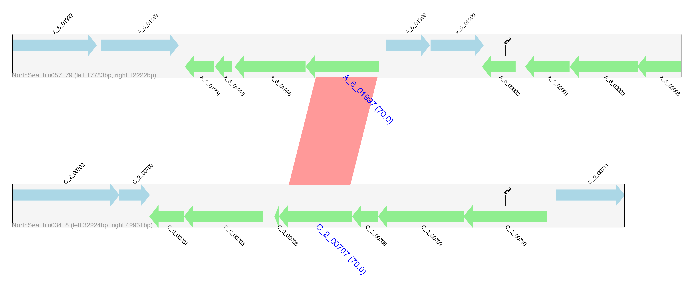
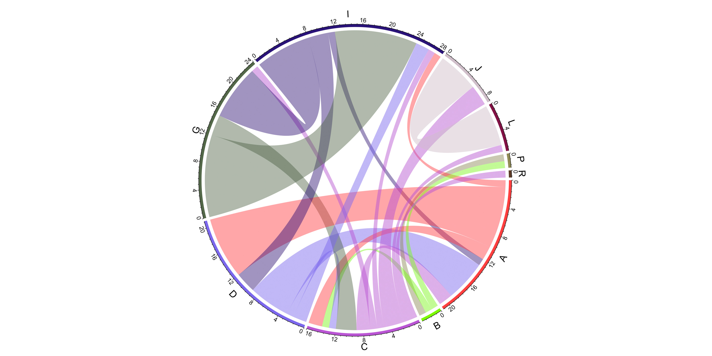

 

Publication:
---

+ In preparation
+ Contact: Weizhi Song (songwz03@gmail.com)
+ Department of Ocean Science, Hong Kong University of Science and Technology, Hong Kong

What has been changed:
---

1. Input genomes need to be provided in genbank format (previously in fasta format), 
   you can use [Prokka](https://github.com/tseemann/prokka) to generate them.
   please note that contig ids still need to be shorter than 18 bp.

1. The user now need to You need to provide a species tree for your input genome.

   The reasion I removed it from MetaCHIP2 is that 
   make the 

   GTDB-Tk is recommended. I have prepared a wrapper called `infer` to infer the species tree using GTDB-Tk.

1. The inferred species tree need to be rooted, `MetaCHIP2 root -h`

1. You can now used `mmseqs linclust` to speed up all-vs-all blastn.

1. The PI and BP modules in MetaCHIP1 has now been merged into one module called `detect`.

Change Log:
---

* v2.3.0 - module added: `circos`
* v2.2.0 - module added: `enrich`
* v2.1.0 - module added: `tree`
* v2.0.0 - Initial release

Dependencies:
---

+ Python libraries: 
[BioPython](https://github.com/biopython/biopython.github.io/), 
[Numpy](http://www.numpy.org),
[SciPy](https://www.scipy.org),
[Matplotlib](http://matplotlib.org) and 
[ETE3](http://etetoolkit.org).

+ Third-party software: 
[GTDBTk](https://github.com/Ecogenomics/GTDBTk), 
[BLAST+](https://blast.ncbi.nlm.nih.gov/Blast.cgi?PAGE_TYPE=BlastDocs&DOC_TYPE=Download),
[MMseqs2](https://github.com/soedinglab/MMseqs2)(optional), 
[MAFFT](https://mafft.cbrc.jp/alignment/software/),
[Ranger-DTL 2.0](https://compbio.engr.uconn.edu/software/RANGER-DTL/) (part of MetaCHIP, no need to install) and 
[FastTree](http://www.microbesonline.org/fasttree/).

How to install:
---

1. Install MetaCHIP2 with Conda
 
       conda create -n metachip2env -c conda-forge -c bioconda gtdbtk=2.3.2
       source activate metachip2env
       pip install MetaCHIP2
       conda install -c bioconda blast
       conda install -c bioconda diamond
       conda install -c bioconda mmseqs2
       conda install -c conda-forge r-base

1. Type `pip3 install --upgrade MetaCHIP2` to get the latest version.

1. :warning: If you clone the repository directly off GitHub you might end up with a version that is still under development.

How to run:
---

+ The input files for MetaCHIP include a folder that holds the sequence file ([example](https://github.com/songweizhi/MetaCHIP/blob/master/input_file_examples/human_gut_bins))
of all query genomes, as well as a text file which provides taxonomic classification ([example](https://github.com/songweizhi/MetaCHIP/blob/master/input_file_examples/human_gut_bins_GTDB.tsv)) 
or customized grouping ([example](https://github.com/songweizhi/MetaCHIP/blob/master/input_file_examples/customized_grouping.txt))
of your input genomes. File extension of your input genomes (e.g. fa, fasta) should **NOT** be included in the taxonomy or grouping file.

+ [**GTDB-Tk**](https://github.com/Ecogenomics/GTDBTk) is recommended for taxonomic classification of input genomes. Only the first two columns ('user_genome' and 'classification') in GTDB-Tk's output file are needed. 

      gtdbtk classify_wf --cpus 12 --pplacer_cpus 1 --genome_dir gnms --skip_ani_screen --extension fna --out_dir gnms_GTDB_r214 --prefix gnms_GTDB_r214

+ Options for argument '-r' in the PI and BP modules can be any combinations of d (domain), p (phylum), c (class), o (order), f (family), g (genus) and s(species).

+ Some examples: 

       MetaCHIP2 detect -i gbk_dir -x gbk -c taxon.tsv -s rooted.tree -v -t 12 -f -p demo -r pcofg -m
       MetaCHIP2 detect -i gbk_dir -x gbk -c taxon.tsv -s rooted.tree -v -t 12 -f -p demo -r pco
       MetaCHIP2 detect -i gbk_dir -x gbk -c taxon.tsv -s rooted.tree -v -t 12 -f -p demo -r p -b blastn_op

Output files:
---

1. A Tab delimited text file (detected_HGTs.txt) containing all identified HGTs.

    |Column|Description|
    |---|---|
    |Gene_1|The 1st gene involved in a HGT event|
    |Gene_2|The 2nd gene involved in a HGT event|
    |Identity|Identity between Gene_1 and Gene_2|
    |Occurence(taxon_ranks)|Only for multiple-level detections. If you performed HGT detection at phylum, class and order levels, a number of "011" means current HGT was identified at class and order levels, but not phylum level.|
    |End_match|End match or not (see examples below)|
    |Full_length_match|Full length match or not (see examples below)|
    |Direction|The direction of gene flow. Number in parenthesis refers to the percentage of this direction being observed if this HGT was detected at multiple ranks and different directions were provided by Ranger-DTL.|   

1. Nucleotide and amino acid sequences of identified HGTs.

1. Flanking regions of identified HGTs. Genes encoded on the forward strand are displayed in light blue, and genes coded on the reverse strand are displayed in light green. The name of genes predicted to be HGT are highlighted in blue, large font with pairwise identity given in parentheses. Contig names are provided at the left bottom of the sequence tracks and numbers following the contig name refer to the distances between the gene subject to HGT and either the left or right end of the contig. Red bars show similarities of the matched regions between the contigs based on BLASTN results.
    
 
1. Gene flow between groups. Bands connect donors and recipients, with the width of the band correlating to the number of HGTs and **the colour corresponding to the donors**.
    
