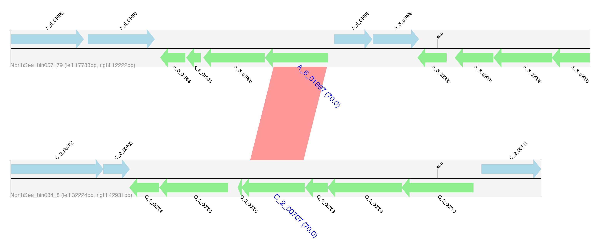
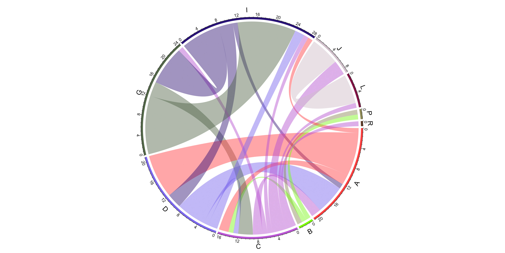

 

Contact
---

Shan Zhang ([link](https://www.pharma.hku.hk/en/Our-People/Professoriate-Staff/Research-Assistant-Professor/Shan-ZHANG/Shan-ZHANG-Profile))1 and Weizhi Song ([link](https://facultyprofiles.hkust.edu.hk/profiles.php?profile=weizhi-song-ocessongwz))2

1 Department of Pharmacology and Pharmacy, LKS Faculty of Medicine, The University of Hong Kong, Hong Kong

2 Department of Ocean Science, Hong Kong University of Science and Technology, Hong Kong

Email: shanbio@hku.hk, ocessongwz@ust.hk

What has been changed:
---

+ For MetaCHIP2 analysis, the input genomes must be in GenBank format. If your genomes are currently in FASTA format, you 
will need to perform an initial annotation step before feeding them to MetaCHIP2. This pre-annotation strategy offers 
several advantages: **1)** this could bypass the need for repeated genome annotation when exploring MetaCHIP2 parameters, 
thereby reducing computational time. **2)** this could minimize the introduction of variations from the annotation process 
itself, and thus ensures better comparability of predictions between independent MetaCHIP2 runs. You can use 
MetaCHIP2's `prokka` module to batch generate the .gbk files for your input genomes.

+ The user now need to provide a species tree for the input genome. Again, this could avoid repeated tree inference, 
which in turn leads to more consistent and comparable predictions between separate MetaCHIP2 runs on the same set of input genomes.
You can use MetaCHIP2's `tree` module to infer the species tree, This module wraps GTDB-Tk's `identify`, `align`, and `infer` functionalities.

+ The inferred species tree must be rooted, as required by Ranger-DTL (one of MetaCHIP2's dependency). 
If you use MetaCHIP2's `tree` module for tree inference, the tree will be automatically rooted according to the GTDB taxonomy.
If you use your own way to get the species tree, please make sure that it is properly rooted.

+ The `PI` and `BP` modules in MetaCHIP has now been merged into a single module called `detect` in MetaCHIP2.

+ You can now use `mmseqs linclust` (by specifying '-m' to the `detect `module) to speed up the time-consuming all-vs-all blastn step in MetaCHIP2.

+ A changelog is [here](MetaCHIP2/VERSION).

Dependencies:
---

+ Python libraries: 
[BioPython](https://github.com/biopython/biopython.github.io/), 
[Numpy](http://www.numpy.org),
[SciPy](https://www.scipy.org),
[Matplotlib](http://matplotlib.org) and 
[ETE3](http://etetoolkit.org).

+ Third-party software: 
[GTDBTk](https://github.com/Ecogenomics/GTDBTk), 
[BLAST+](https://blast.ncbi.nlm.nih.gov/Blast.cgi?PAGE_TYPE=BlastDocs&DOC_TYPE=Download),
[MMseqs2](https://github.com/soedinglab/MMseqs2)(optional), 
[MAFFT](https://mafft.cbrc.jp/alignment/software/),
[Ranger-DTL 2.0](https://compbio.engr.uconn.edu/software/RANGER-DTL/) (part of MetaCHIP, no need to install) and 
[FastTree](http://www.microbesonline.org/fasttree/).

Install MetaCHIP2 with Conda:
---

+ As MetaCHIP2 requires GTDB-Tk, we'll create a Conda environment pre-installed with GTDB-Tk.
 
       conda create -n metachip2env -c conda-forge -c bioconda gtdbtk=2.6.1
       conda activate metachip2env
       pip install MetaCHIP2
       conda install -c bioconda blast
       conda install -c bioconda diamond
       conda install -c bioconda mmseqs2
       conda install -c conda-forge legacy-cgi
       conda install -c conda-forge r-base

+ Upgrade MetaCHIP2 with: `pip3 install --upgrade MetaCHIP2`

How to run:
---

+ The input files for MetaCHIP2 include a folder that holds the gbk file of all query genomes, as well as a text file which provides taxonomic classification ([example](https://github.com/songweizhi/MetaCHIP/blob/master/input_file_examples/human_gut_bins_GTDB.tsv)) 
or customized grouping ([example](https://github.com/songweizhi/MetaCHIP/blob/master/input_file_examples/customized_grouping.txt))
of the input genomes. File extension (e.g., gbk) of the input genomes should **NOT** be included in the taxonomy or grouping file.

+ Input files for MetaCHIP2 must be in GenBank format. You can use MetaCHIP2's `prokka` module to batch generate the .gbk files for all your input genomes. To prevent potential Prokka errors, please ensure that **contig IDs remain shorter than 18 characters**.

       MetaCHIP2 prokka -h

+ The user now need to provide a species tree for the input genome. You can use MetaCHIP2's `tree` module to infer the species tree, which wraps GTDB-Tk's `identify`, `align`, and `infer` functionalities.
The inferred species tree must be rooted, as required by Ranger-DTL (one of MetaCHIP2's dependency). 
If you use MetaCHIP2's `tree` module for tree inference, the tree will be automatically rooted according to the GTDB taxonomy.
If you use your own way to get the species tree, please make sure that it is properly rooted.

       MetaCHIP2 tree -h

+ You can now use `mmseqs linclust` (by specifying '-m' to `detect `module) to speed up the time-consuming all-vs-all blastn step.
       
       MetaCHIP2 detect -i gbk_dir -x gbk -c taxon.tsv -s rooted.tree -t 12 -f -o op_dir -p demo -r pcofg -m

+ If you already have the all-vs-all blastn results on the same set of input genomes from a previous run, you can skip the blastn  by providing the blastn results with '-b'.
       
       MetaCHIP2 detect -i gbk_dir -x gbk -c taxon.tsv -s rooted.tree -t 12 -f -o op_dir -p demo -r p -b path/to/previous/run/blastn_op

+ [**GTDB-Tk**](https://github.com/Ecogenomics/GTDBTk) is recommended for taxonomic classification of input genomes. Only the first two columns (user_genome and classification) are needed. 

+ Options for argument '-r' in the `detect` modules can be any combinations of d (domain), p (phylum), c (class), o (order), f (family), g (genus) and s(species):

       MetaCHIP2 detect -i gbk_dir -x gbk -c taxon.tsv -s rooted.tree -t 12 -f -o op_dir -p demo -r pcofg
       MetaCHIP2 detect -i gbk_dir -x gbk -c taxon.tsv -s rooted.tree -t 12 -f -o op_dir -p demo -r pco
       MetaCHIP2 detect -i gbk_dir -x gbk -c taxon.tsv -s rooted.tree -t 12 -f -o op_dir -p demo -r ofg

Output files:
---

1. A Tab delimited text file (detected_HGTs.txt) containing all identified HGTs.

    |Column|Description|
    |---|---|
    |Gene_1|The 1st gene involved in a HGT event|
    |Gene_2|The 2nd gene involved in a HGT event|
    |Identity|Identity between Gene_1 and Gene_2|
    |Occurence(taxon_ranks)|Only for multiple-level detections. If you performed HGT detection at phylum, class and order levels, a number of "011" means current HGT was identified at class and order levels, but not phylum level.|
    |End_match|End match or not (see examples below)|
    |Full_length_match|Full length match or not (see examples below)|
    |Direction|The direction of gene flow. Number in parenthesis refers to the percentage of this direction being observed if this HGT was detected at multiple ranks and different directions were provided by Ranger-DTL.|   

1. Nucleotide and amino acid sequences of identified HGTs.

1. Flanking regions of identified HGTs. Genes encoded on the forward strand are displayed in light blue, and genes coded on the reverse strand are displayed in light green. The name of genes predicted to be HGT are highlighted in blue, large font with pairwise identity given in parentheses. Contig names are provided at the left bottom of the sequence tracks and numbers following the contig name refer to the distances between the gene subject to HGT and either the left or right end of the contig. Red bars show similarities of the matched regions between the contigs based on BLASTN results.
    
 
1. Gene flow between groups. Bands connect donors and recipients, with the width of the band correlating to the number of HGTs and **the colour corresponding to the donors**.
    

   If you want to get gene flow plot for a subset of detected HGTs (e.g., HGTs belong to a specific functional group), you can subset the "detected_HGTs.txt" to keep only the interested HGTs and run the `circos` module. You can find the grouping file from MetaCHIP2's output directory.

       MetaCHIP2 circos -o circos_2.pdf -l detected_HGTs_subset.txt -g grouping.txt
